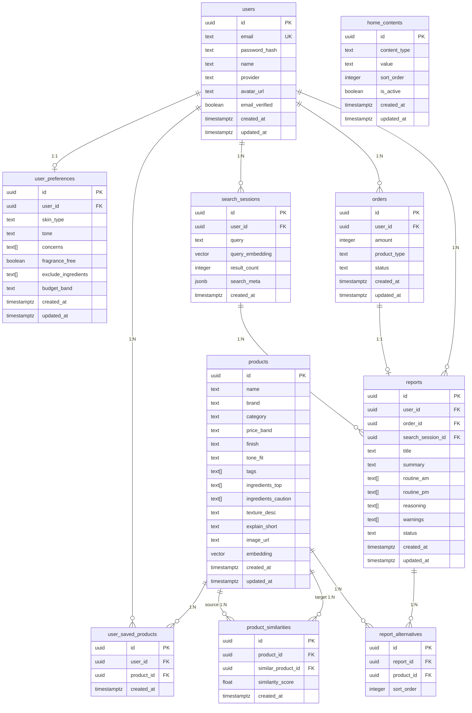

# K-Glow ERD — 데이터베이스 테이블 및 속성 설계

> **프로젝트**: K-Beauty Whisperer (K-Glow AI Search)  
> **버전**: V1  
> **기반 문서**: `BACKEND_DATA_IA.md`  
> **DB 플랫폼**: Supabase (PostgreSQL)  
> **목적**: SQL 작성 전 테이블 구조와 관계를 확정하기 위한 논리 ERD

---

## ER 다이어그램

---

## 테이블 상세 설계

### 1. `users` — 사용자

> Supabase Auth (`auth.users`)와 연동. 이 테이블은 `public.users`로 프로필 확장용.

| 컬럼 | 타입 | 제약 조건 | 설명 |
|------|------|-----------|------|
| `id` | `uuid` | **PK**, `auth.users.id` 참조 | Supabase Auth UID |
| `email` | `text` | UNIQUE, NOT NULL | 이메일 주소 |
| `password_hash` | `text` | NULL 가능 | Supabase Auth에서 관리 (이 테이블에 직접 저장 X) |
| `name` | `text` | NULL 가능 | 표시 이름 |
| `provider` | `text` | NOT NULL, DEFAULT `'email'` | 인증 방식: `email`, `google` |
| `avatar_url` | `text` | NULL 가능 | 프로필 이미지 URL |
| `email_verified` | `boolean` | DEFAULT `false` | 이메일 인증 완료 여부 |
| `created_at` | `timestamptz` | DEFAULT `now()` | 가입 일시 |
| `updated_at` | `timestamptz` | DEFAULT `now()` | 최종 수정 일시 |

**인덱스**: `email` (unique)

---

### 2. `user_preferences` — 사용자 선호도 (내 조건)

> `users` 1:1 관계. 사용자당 1개의 선호도 레코드.

| 컬럼 | 타입 | 제약 조건 | 설명 |
|------|------|-----------|------|
| `id` | `uuid` | **PK**, DEFAULT `gen_random_uuid()` | |
| `user_id` | `uuid` | **FK** → `users.id`, UNIQUE, NOT NULL | 사용자 ID |
| `skin_type` | `text` | NULL 가능 | 피부 타입: `건성`, `지성`, `복합`, `민감` |
| `tone` | `text` | NULL 가능 | 퍼스널 컬러 톤: `웜`, `쿨`, `뉴트럴`, `모름` |
| `concerns` | `text[]` | DEFAULT `'{}'` | 피부 고민: `홍조`, `트러블`, `속건조`, `모공`, `각질`, `잡티`, `주름`, `다크서클` |
| `fragrance_free` | `boolean` | DEFAULT `false` | 무향 선호 여부 |
| `exclude_ingredients` | `text[]` | DEFAULT `'{}'` | 제외 성분: `향료`, `에탄올`, `실리콘`, `파라벤` |
| `budget_band` | `text` | NULL 가능 | 예산대: `1-3만`, `3-5만`, `5만+` |
| `created_at` | `timestamptz` | DEFAULT `now()` | |
| `updated_at` | `timestamptz` | DEFAULT `now()` | |

**인덱스**: `user_id` (unique)

---

### 3. `products` — 제품

> K-뷰티 제품 마스터 테이블. 벡터 검색의 대상.

| 컬럼 | 타입 | 제약 조건 | 설명 |
|------|------|-----------|------|
| `id` | `uuid` | **PK**, DEFAULT `gen_random_uuid()` | |
| `name` | `text` | NOT NULL | 제품명 |
| `brand` | `text` | NOT NULL | 브랜드명 |
| `category` | `text` | NOT NULL | 카테고리: `skincare`, `base`, `lip`, `eye`, `suncare` |
| `price_band` | `text` | NULL 가능 | 가격대: `1-3만`, `3-5만`, `5만+` |
| `finish` | `text` | NULL 가능 | 피니시: `글로우`, `새틴`, `크리미`, `매트` 등 |
| `tone_fit` | `text` | NULL 가능 | 톤핏: `warm`, `cool`, `neutral`, `any` |
| `tags` | `text[]` | DEFAULT `'{}'` | 태그 배열: `수분충전`, `글로우`, `진정` 등 |
| `ingredients_top` | `text[]` | DEFAULT `'{}'` | 핵심 성분 배열 |
| `ingredients_caution` | `text[]` | DEFAULT `'{}'` | 주의 성분 배열 |
| `texture_desc` | `text` | NULL 가능 | 제형/사용감 설명 |
| `explain_short` | `text` | NULL 가능 | AI 추천 요약 (1~2문장) |
| `image_url` | `text` | NULL 가능 | 제품 이미지 URL |
| `embedding` | `vector(1536)` | NULL 가능 | OpenAI `text-embedding-3-small` 벡터 |
| `created_at` | `timestamptz` | DEFAULT `now()` | |
| `updated_at` | `timestamptz` | DEFAULT `now()` | |

**인덱스**: `category`, `brand`, `embedding` (ivfflat / hnsw)

---

### 4. `product_similarities` — 유사 제품 관계

> `products` 자기 참조 N:M 관계 (방향성 있음).

| 컬럼 | 타입 | 제약 조건 | 설명 |
|------|------|-----------|------|
| `id` | `uuid` | **PK**, DEFAULT `gen_random_uuid()` | |
| `product_id` | `uuid` | **FK** → `products.id`, NOT NULL | 원본 제품 |
| `similar_product_id` | `uuid` | **FK** → `products.id`, NOT NULL | 유사 제품 |
| `similarity_score` | `float` | NULL 가능 | 유사도 점수 (0.0 ~ 1.0) |
| `created_at` | `timestamptz` | DEFAULT `now()` | |

**제약**: UNIQUE(`product_id`, `similar_product_id`) — 동일 쌍 중복 방지  
**인덱스**: `product_id`

---

### 5. `user_saved_products` — 사용자 저장 제품

> `users` ↔ `products` 다:다(N:M) 관계 조인 테이블.

| 컬럼 | 타입 | 제약 조건 | 설명 |
|------|------|-----------|------|
| `id` | `uuid` | **PK**, DEFAULT `gen_random_uuid()` | |
| `user_id` | `uuid` | **FK** → `users.id`, NOT NULL | 저장한 사용자 |
| `product_id` | `uuid` | **FK** → `products.id`, NOT NULL | 저장된 제품 |
| `created_at` | `timestamptz` | DEFAULT `now()` | 저장 일시 |

**제약**: UNIQUE(`user_id`, `product_id`) — 동일 제품 중복 저장 방지  
**인덱스**: `user_id`, `product_id`

---

### 6. `search_sessions` — 검색 세션

> 사용자의 검색 쿼리와 결과 메타데이터를 기록.

| 컬럼 | 타입 | 제약 조건 | 설명 |
|------|------|-----------|------|
| `id` | `uuid` | **PK**, DEFAULT `gen_random_uuid()` | |
| `user_id` | `uuid` | **FK** → `users.id`, NULL 가능 | 검색한 사용자 (비로그인 시 NULL) |
| `query` | `text` | NOT NULL | 검색 쿼리 원문 |
| `query_embedding` | `vector(1536)` | NULL 가능 | 쿼리 임베딩 벡터 |
| `result_count` | `integer` | DEFAULT `0` | 검색 결과 수 |
| `search_meta` | `jsonb` | NULL 가능 | 검색 메타 정보 (`top_brands`, `top_tags`, `category_distribution` 등) |
| `created_at` | `timestamptz` | DEFAULT `now()` | 검색 일시 |

**인덱스**: `user_id`, `created_at DESC`

---

### 7. `orders` — 결제 주문

> 프리미엄 루틴 리포트 구매 결제 정보.

| 컬럼 | 타입 | 제약 조건 | 설명 |
|------|------|-----------|------|
| `id` | `uuid` | **PK**, DEFAULT `gen_random_uuid()` | |
| `user_id` | `uuid` | **FK** → `users.id`, NOT NULL | 구매 사용자 |
| `amount` | `integer` | NOT NULL | 결제 금액 (원 단위, 예: 4900) |
| `product_type` | `text` | NOT NULL | 상품 유형: `routine_report` |
| `status` | `text` | NOT NULL, DEFAULT `'pending'` | 상태: `pending`, `paid`, `cancelled`, `refunded` |
| `created_at` | `timestamptz` | DEFAULT `now()` | 주문 일시 |
| `updated_at` | `timestamptz` | DEFAULT `now()` | 상태 변경 일시 |

**인덱스**: `user_id`, `status`

---

### 8. `reports` — AI 루틴 리포트

> AI가 생성한 맞춤형 스킨케어 루틴 리포트.

| 컬럼 | 타입 | 제약 조건 | 설명 |
|------|------|-----------|------|
| `id` | `uuid` | **PK**, DEFAULT `gen_random_uuid()` | |
| `user_id` | `uuid` | **FK** → `users.id`, NOT NULL | 소유 사용자 |
| `order_id` | `uuid` | **FK** → `orders.id`, UNIQUE, NULL 가능 | 연결된 주문 |
| `search_session_id` | `uuid` | **FK** → `search_sessions.id`, NULL 가능 | 리포트 생성 기반 검색 세션 |
| `title` | `text` | NOT NULL | 리포트 제목 |
| `summary` | `text` | NULL 가능 | 요약 문구 |
| `routine_am` | `text[]` | DEFAULT `'{}'` | AM 루틴 단계 배열 |
| `routine_pm` | `text[]` | DEFAULT `'{}'` | PM 루틴 단계 배열 |
| `reasoning` | `text[]` | DEFAULT `'{}'` | 조합 근거 배열 |
| `warnings` | `text[]` | DEFAULT `'{}'` | 주의 조합 배열 |
| `status` | `text` | NOT NULL, DEFAULT `'generating'` | 생성 상태: `generating`, `completed`, `failed` |
| `created_at` | `timestamptz` | DEFAULT `now()` | |
| `updated_at` | `timestamptz` | DEFAULT `now()` | |

**인덱스**: `user_id`, `order_id` (unique), `status`

---

### 9. `report_alternatives` — 리포트 대체 제품

> `reports` ↔ `products` 다:다(N:M) 관계 조인 테이블. 리포트에서 추천하는 대체 제품.

| 컬럼 | 타입 | 제약 조건 | 설명 |
|------|------|-----------|------|
| `id` | `uuid` | **PK**, DEFAULT `gen_random_uuid()` | |
| `report_id` | `uuid` | **FK** → `reports.id`, NOT NULL | 리포트 ID |
| `product_id` | `uuid` | **FK** → `products.id`, NOT NULL | 대체 제품 ID |
| `sort_order` | `integer` | DEFAULT `0` | 표시 순서 |

**제약**: UNIQUE(`report_id`, `product_id`)  
**인덱스**: `report_id`

---

### 10. `home_contents` — 홈 페이지 콘텐츠

> CMS 성격 테이블. 홈 예시 칩, 예시 문장, 트렌드 태그 관리.

| 컬럼 | 타입 | 제약 조건 | 설명 |
|------|------|-----------|------|
| `id` | `uuid` | **PK**, DEFAULT `gen_random_uuid()` | |
| `content_type` | `text` | NOT NULL | 콘텐츠 타입: `example_chip`, `example_sentence`, `trend_tag` |
| `value` | `text` | NOT NULL | 콘텐츠 내용 (예: "글로우 피부") |
| `sort_order` | `integer` | DEFAULT `0` | 표시 순서 |
| `is_active` | `boolean` | DEFAULT `true` | 활성화 여부 |
| `created_at` | `timestamptz` | DEFAULT `now()` | |
| `updated_at` | `timestamptz` | DEFAULT `now()` | |

**인덱스**: `content_type`, `is_active`

---

## 테이블 관계 요약

| 관계 | 타입 | 설명 |
|------|------|------|
| `users` → `user_preferences` | **1:1** | 사용자당 선호도 1개 |
| `users` → `user_saved_products` | **1:N** | 사용자가 여러 제품 저장 |
| `users` → `search_sessions` | **1:N** | 사용자가 여러 검색 수행 |
| `users` → `orders` | **1:N** | 사용자가 여러 주문 생성 |
| `users` → `reports` | **1:N** | 사용자가 여러 리포트 소유 |
| `products` → `user_saved_products` | **1:N** | 여러 사용자가 제품 저장 |
| `products` → `product_similarities` | **1:N** (self) | 제품 간 유사 관계 |
| `products` → `report_alternatives` | **1:N** | 여러 리포트에서 대체로 추천 |
| `search_sessions` → `reports` | **1:N** | 하나의 검색에서 여러 리포트 생성 가능 |
| `orders` → `reports` | **1:1** | 주문 1건당 리포트 1개 |
| `reports` → `report_alternatives` | **1:N** | 리포트 내 여러 대체 제품 |

---

## 설계 참고 사항

| 항목 | 결정 사항 |
|------|-----------|
| **PK 전략** | 모든 테이블 `uuid` (Supabase `gen_random_uuid()`) |
| **시간 컬럼** | `timestamptz` 사용 (타임존 포함) |
| **배열 컬럼** | PostgreSQL 네이티브 `text[]` 사용 (`tags`, `concerns` 등) |
| **벡터 컬럼** | `pgvector` 확장의 `vector(1536)` 타입 (OpenAI embedding 차원) |
| **JSON 컬럼** | `search_meta`는 구조가 유동적이므로 `jsonb` 처리 |
| **Soft Delete** | V1에서는 하드 삭제. 필요 시 `deleted_at` 컬럼 추가 |
| **RLS** | Supabase RLS로 `user_id = auth.uid()` 기반 행 수준 보안 적용 |
| **updated_at 자동화** | PostgreSQL trigger로 `updated_at` 자동 갱신 |
| **인증** | Supabase Auth 사용 — `users` 테이블은 `auth.users` 확장 프로필 |
